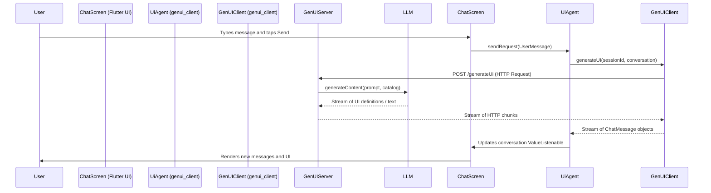

# Refactoring `simple_chat` to a `genui_client` Example

## Overview

This document outlines the plan to refactor the existing `simple_chat` example, which currently uses the `flutter_genui` package and a direct Firebase connection, into a new example for the `genui_client` package. The new example will demonstrate the intended client-server architecture by connecting to a `genui_server` instance, which in turn communicates with the generative AI model. This provides a clear, practical example of how to use `genui_client` as a replacement for the higher-level `flutter_genui` abstraction.

## Detailed Analysis of the Goal

### Current State

The `simple_chat` example, located in `examples/simple_chat`, is a basic chat application that demonstrates the capabilities of the `flutter_genui` package. Its key characteristics are:

- **Dependencies**: It directly depends on `flutter_genui` and `firebase_core`.
- **Architecture**: It initializes a Firebase connection and uses the `UiAgent` from `flutter_genui` to interact directly with a generative model (e.g., a Google AI model via Firebase).
- **Functionality**: It allows a user to send text prompts and displays both the user's messages and the AI's responses, which can include generated UI surfaces.

### Target State

The goal is to create a new, self-contained example within the `genui_client` package, located at `packages/genui_client/example`. This new example will be a port of `simple_chat` but will showcase the `genui_client` library.

The key characteristics of the new example will be:

- **Dependencies**: It will depend on `genui_client` (via a path dependency) and will not have a direct dependency on `flutter_genui` or `firebase_core`.
- **Architecture**: It will follow a client-server model. The Flutter application will act as the client, using `genui_client`'s `UiAgent` to communicate with a running `genui_server` instance over HTTP. The server will be responsible for all interactions with the generative model.
- **Functionality**: The user-facing functionality will remain nearly identical to the original `simple_chat` example, providing a clear "before and after" comparison of the two approaches.
- **Documentation**: The example will include a `README.md` file explaining how to set up and run both the Flutter client and the required `genui_server`.

## Alternatives Considered

1.  **Modify `simple_chat` in place**: This was rejected because the primary purpose of `simple_chat` is to serve as an example for `flutter_genui`. Altering it to use `genui_client` would eliminate its value in that context and would not align with the goal of creating a _new_ example specifically for `genui_client`.

2.  **Create a completely new, different example**: While a possibility, porting the existing `simple_chat` example is a more effective approach for this specific goal. It allows developers to directly compare the two implementations (`flutter_genui` vs. `genui_client`) and understand the specific changes required to migrate from one to the other. This provides a more valuable learning experience.

The chosen approach of porting `simple_chat` to a new directory under `packages/genui_client/example` is the most direct and effective way to achieve the stated goal.

## Detailed Design

### 1. Project Structure

A new Flutter application will be created at `packages/genui_client/example`. It will follow the standard Flutter project layout.

### 2. Dependencies (`pubspec.yaml`)

The `pubspec.yaml` for the new example will be updated to:

- Remove the `flutter_genui` and `firebase_core` dependencies.
- Add a path dependency on the `genui_client` package:
  ```yaml
  dependencies:
    genui_client:
      path: ../
  ```
- Add the `logging` package for log configuration.

### 3. Application Logic (`lib/main.dart`)

The core logic in `main.dart` will be significantly refactored.

- **Initialization**:

  - The `Firebase.initializeApp()` call will be removed from `main()`.
  - In `_ChatScreenState`, the `UiAgent` will be instantiated from the `genui_client` package. It will not require a system prompt, as this logic now resides on the server.
  - An asynchronous `_init()` method will be added to `_ChatScreenState` to call `await _uiAgent.startSession()`. This establishes a connection with the `genui_server` and prepares it for generating UI.

- **State Management**:

  - The `_messages` list will be removed. The UI will now be driven by `_uiAgent.conversation`, which is a `ValueListenable<List<ChatMessage>>`. This provides a reactive stream of messages from the agent.
  - The loading indicator will be bound to the `_uiAgent.isProcessing` `ValueListenable`.

- **UI Rendering**:

  - The `ListView.builder` will be replaced with a `GenUiChat` widget from the `genui_client` package. This widget handles the complexities of rendering the conversation list and providing a text input box.
  - The `GenUiChat` widget will be configured with the `UiAgent` instance.
  - The `_onSurfaceAdded` callback and the `MessageController`/`MessageView` classes will be removed, as their functionality is now encapsulated within `genui_client`'s `UiAgent` and `GenUiChat` widget.

- **Sending Messages**:
  - The `_sendMessage` method will be simplified. It will now call `await _uiAgent.sendRequest(UserMessage.text(text))` to send the user's input to the `genui_server` via the `UiAgent`.

### 4. Code Cleanup

- The `lib/message.dart` and `lib/firebase_options_stub.dart` files will be deleted as they are no longer needed.
- A `lib/firebase_options.dart` will not be generated or included, as Firebase is no longer a client-side dependency.

### 5. Documentation (`README.md`)

A new `README.md` file will be created for the example with clear instructions on:

1.  How to start the `genui_server` from `packages/genui_server`.
2.  How to run the Flutter example application.
3.  The expected interaction flow.

## Diagrams

### Client-Server Interaction Flow

This diagram illustrates the sequence of operations when a user sends a message.



## Summary

The refactor involves creating a new Flutter example that faithfully ports the UI/UX of `simple_chat`. The key architectural change is the removal of `flutter_genui` and direct Firebase integration in favor of the `genui_client` package, which communicates with a separate `genui_server` process. This will result in a cleaner separation of concerns and provide a canonical example for developers on how to use the new client-server architecture.

## References

- [genui_client Package](/packages/genui_client/lib/genui_client.dart)
- [genui_server Package](/packages/genui_server/src/index.ts)
